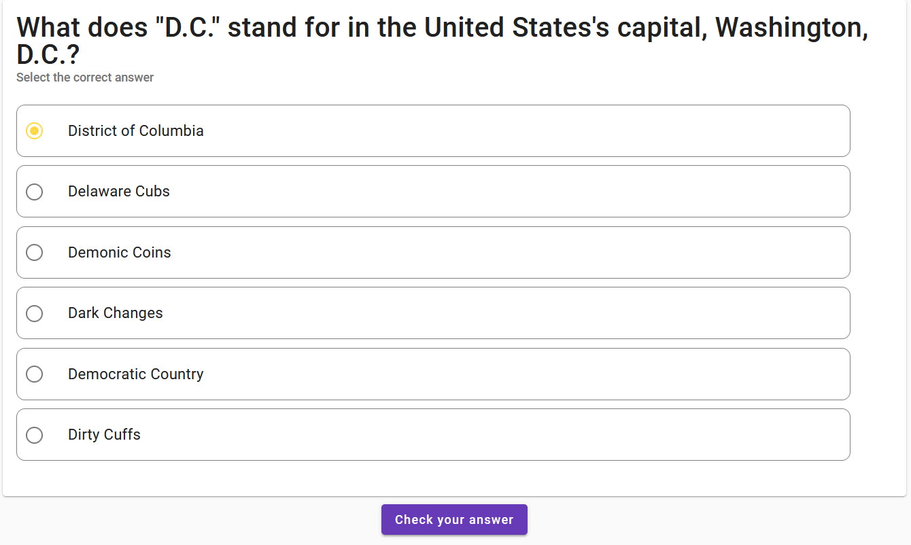

# QuizWorld

Quiz World is an application that allows users to participate in and create quizzes. Quizzes consist of single-choice, multiple-choice, and text questions. This project is a server-side RESTful application for Quiz World, written in ASP.NET 6.

## Preview images

<details>
<summary>Toggle images</summary>
<br>

</details>


## Running in Docker
To run this in Docker, simply run the ``docker-compose.yml`` file located at the root of the project.
Most of the default environment variables are enough to quickstart the project. The only thing you need to configure locally is an SSL password to enable HTTPS connections. To do this, run the following command in the .NET CLI:

```bash
dotnet dev-certs https -ep %USERPROFILE%\.aspnet\https\aspnetapp.pfx -p 7a15279b-6c3a-42b1-978c-1e5dfa029b7e
dotnet dev-certs https --trust
```

**Note:** a Redis Insight tool is available on localhost:8001 which you can use to monitor your Redis data.

Don't forget to apply the migrations!

## Running manually
To run this project manually:
1) Clone the repository
2) Get yourself a running instance of SQL Server and a running instance of Redis
3) Insert the following configurations / user-secrets / environment secrets:
- ``JWT:Secret`` - secret used for generating and validating JWTs
- ``JWT:ValidIssuer`` - the issuer of the app's JWTs
- ``JWT:ValidAudience`` - the audience of the app's JWTs
- ``REDIS_CONNECTION_STRING`` - a connection string to your Redis database. The Redis database stores invalidated JWTs (as a result of the user logging out), meaning that they cannot be used in authorized requests, even if they are valid.
- ``ALLOWED_HOSTS`` - which clients can send requests to the server. Each domain is separated by a comma and a space (``, ``)
- ``DB_PASSWORD`` - the SA password needed to connect to the database
- ``DB_USER`` - the user with which you will be logging in, typically ``sa``
- ``DB_NAME`` - the name of the database in which the data will be stored
- ``DB_HOST`` - the address where the database is hosted
- ``ADMIN_PASS`` - the password of the admin account
4) Apply the migrations in the ``Infrastructure`` project.

Provided that everything has been set up correctly, you should be able to access the Swagger UI if running this application in development stage.

To run the client associated with this project, [refer to the client-side project's documentation](https://github.com/RyotaMitaraiWeb/Quiz-World).

**Note:** the client assumes that this project runs on localhost:7246 during development stage. Refer to the client's documentation for changing the address to which the client will be sending requests.

## Project architecture
- ``Common`` - holds constant values, such as validation rules and messages, custom enums, and some utility values (for example, an array of roles that can be given to users, constant variables that refer to the names of the roles, etc.). This project is referenced by every other in the project.
- ``Infrastructure`` - holds database configurations, custom model binders and filters, custom authentication settings and policies, and extension methods. This project also provides an entity-agnostic repository, which you can use to access the database for any entity.
- ``Tests`` - holds the application's tests.
- ``Web.ViewModels`` - holds the view models that are used throughout the application, as well as custom validators that are applied to those models.
- ``Web.Contracts`` - holds interfaces that will be implemented by the services.
- ``Web.Services`` - holds the services that the controllers (and potentially other services themselves) will use.
- ``Web``- this is essentially the entry and exit point of the application. It holds controllers and ``Program.cs``.

For more information on each project, refer to its documentation (which can be found in the respective folders). You can also find documentation about more specific features/classes (e.g. a specific service) in its respective subfolder.

## Seeding
An administrator is seeded when the server is initialized. The username and password are "admin" and whatever you passed in the ``ADMIN_PASS`` environment variable, respectively.
